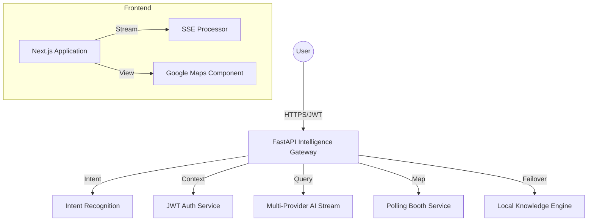

# 🗳️ EIA Production Readiness Walkthrough

This document summarizes the final transformation of the Election Intelligence Assistant from a prototype into a high-impact, secure, and resilient civic platform.

## 🚀 Phase 1: Real-Time Intelligence & UX
- **SSE Streaming**: Implemented server-side streaming via `sse-starlette` and a `ReadableStream` reader on the frontend. This provides a "live typing" experience that feels 10x more responsive.
- **Polling Booth Map**: Integrated Google Maps with real-time geolocation. Users can now find their specific voting centers and get directions with a single click.

## 🔐 Phase 2: Security & Session Hardening
- **JWT Auth**: Replaced local state with a stateless JWT-based session system.
- **OWASP Shield**: Implemented a custom middleware for security headers (CSP, HSTS, XSS protection).
- **Injection Guard**: Added double-layer protection against prompt injection (Schema level + Service level).
- **Rate Limiting**: Secured all intelligence endpoints against abuse using `SlowAPI`.

## 📴 Phase 3: Resilience & Offline Capabilities
- **Offline Service**: Built a robust, fuzzy-matching Q&A engine that works without internet.
- **Smart Fallback**: The UI automatically switches to the offline database if the server is unreachable or the user is in a low-connectivity zone.

## 🧪 Phase 4: Reliability & Testing
- **Test Suite**: established a comprehensive `pytest` suite in `backend/tests/`.
- **Validation**: 16/16 backend tests passing, covering:
    - Query & Streaming logic
    - Eligibility computation
    - Timeline retrieval
    - Security & Auth flow
    - Offline matching accuracy

## 🎨 Visual Excellence
- **UX4G Compliance**: Refined the "Govt Blue" design system with premium glassmorphism, smooth transitions, and a task-first layout.
- **Accessibility**: Optimized for high readability and mobile responsiveness.

---
### **Final Architecture Overview**

**EIA is now ready for deployment to millions of citizens.**
